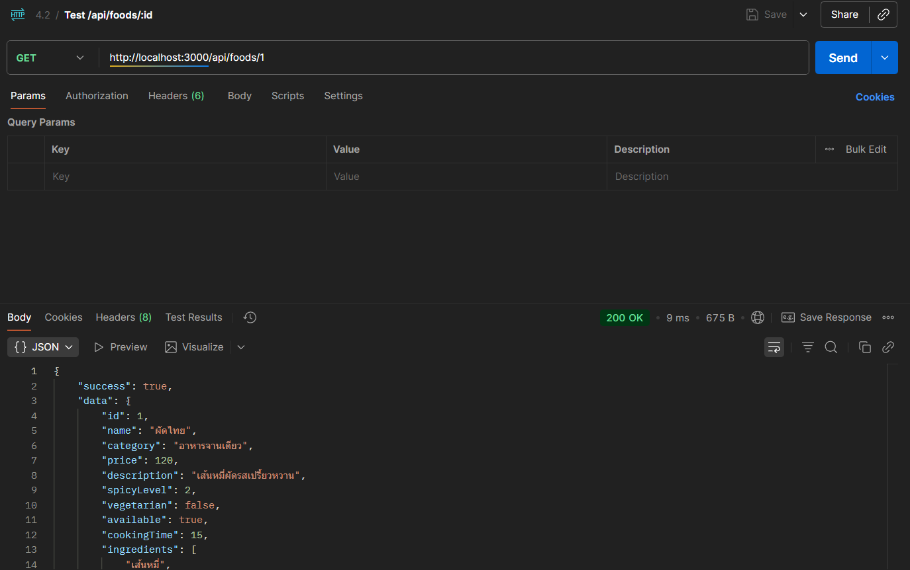
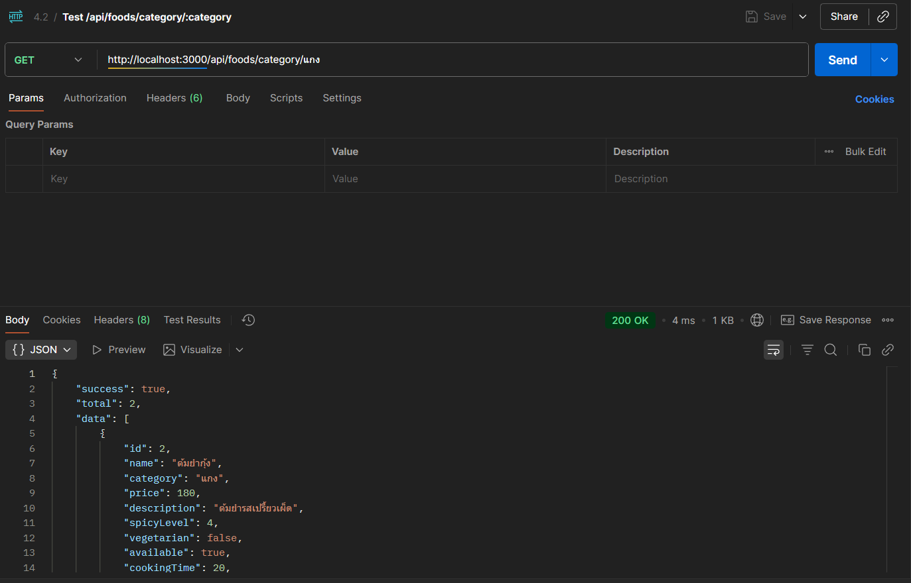

# 🍜 Food API (Lab 4.2)

Food API เป็น RESTful API สำหรับจัดการข้อมูลอาหาร เหมาะสำหรับใช้เรียนรู้ Node.js, Express.js, middleware, และ REST API

---

## 💻 Installation

```bash
# Clone repository
git clone <your-repo-url>
cd lab-4-2-food-api

# ติดตั้ง dependencies
npm install

# รัน server
node server.js


